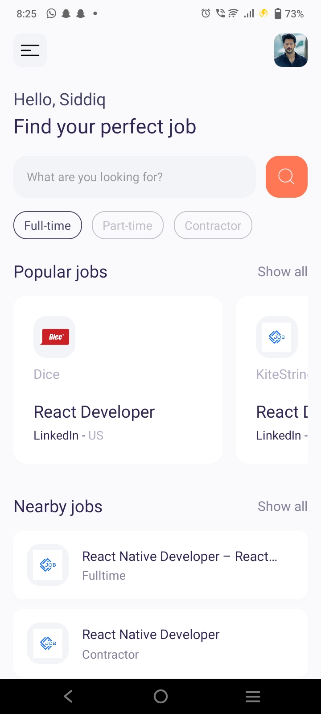

# React-Native Job-IT

## Description

The **Project Name** is a React Native mobile application that helps users find their perfect job from across the internet, all in one place. The app utilizes the power of React Native and Expo for development, while leveraging the JSearch API for fetching job data.

## Screenshots

Here are a few screenshots showcasing the user interface of the app:




## Features

- User-friendly interface for easy navigation and interaction.
- Seamless integration with the JSearch API to fetch job listings.
- Customizable filters and search options to refine job searches.
- Save and bookmark favorite jobs for later reference.
- Apply filters based on job location, industry, salary, and more.
- Real-time notifications for new job postings matching user preferences.
- Detailed job descriptions with information such as requirements, responsibilities, and company details.
- Integration with popular job application platforms for easy application submission.

## Prerequisites

Before you can run the application locally, make sure you have the following prerequisites installed:

- [Node.js](https://nodejs.org) (v12 or higher)
- [Expo CLI](https://expo.io/tools#cli) (v4.0.0 or higher)

## Installation

Follow the steps below to install and run the application:

1. Clone this repository to your local machine.
   ```
   git clone https://github.com/your-username/project-name.git
   ```

2. Navigate to the project directory.
   ```
   cd project-name
   ```

3. Install the project dependencies.
   ```
   npm install
   ```

4. Start the application.
   ```
   expo start
   ```

5. Use the Expo app on your mobile device or an emulator to scan the QR code displayed in the terminal or Metro Bundler web page.

6. Voila! The app should now be up and running on your device.

## Configuration

To configure the app, open the `config.js` file located in the project's root directory. Modify the following parameters to suit your needs:

```javascript
module.exports = {
  API_KEY: 'your-api-key',
  // Add any other configuration options here
};
```

## Contributing

Contributions to the **Project Name** are welcome and encouraged! If you have any ideas, suggestions, or bug reports, please open an issue or submit a pull request.

When contributing, please adhere to the following guidelines:
- Fork the repository and create a new branch for your feature or bug fix.
- Commit your changes with descriptive commit messages.
- Make sure your code passes the linting rules and tests.
- Open a pull request, providing a detailed description of your changes.

## License

This project is licensed under the [MIT License](LICENSE).

## Acknowledgments

- Mention any libraries, tools, or resources that were used in the development of the app.
- Give credit to any tutorials, articles, or code snippets that inspired or helped you in your development journey.

## Contact

For any inquiries or feedback, please contact [mohammed siddiq](siddikhacker@gmail.com).


Feel free to customize the README file further based on your specific project requirements. Good luck with your project!
